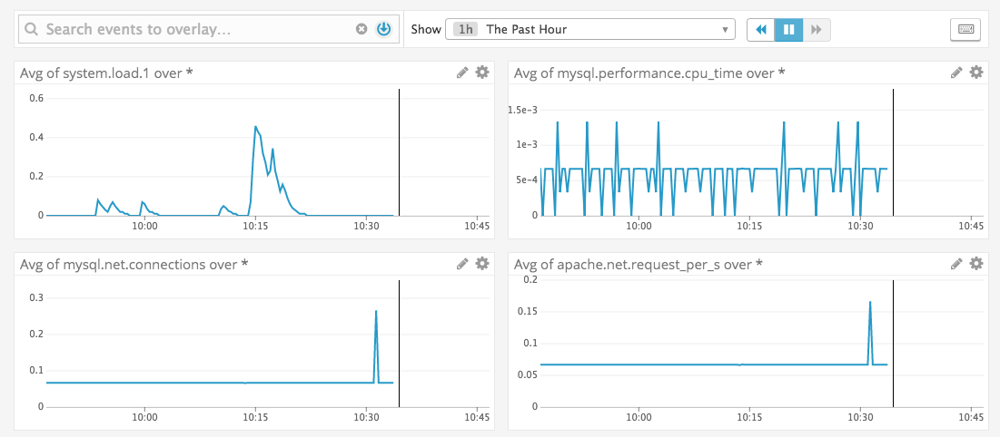

<h1> Monitoring the LAMP stack with Datadog  </h1>

 

The LAMP stack is a set of open-source software used for creating websites and web applications. Lamp is named for its four original components — Linux, Apache, MySQL, and PHP — and, though evolving to include alternatives like Python and Perl, it has retained its open-source nature. LAMP's cost-effective and flexible approach to web infrastructure makes it the most popular solution stack for hosting websites and web apps.

 

By providing real-time collection and vizualization of key metrics across each layer of the LAMP stack, Datadog offers a flexible and customizeable way to monitor your web app's performance and usage.

<figure>
    
    <figcaption>A custom dashboard created with Datadog</figcaption>
</figure>

 

In this post, you'll learn how to:

<ul>
  <li>Install the Datadog agent</li>
  <li>Integrate each layer of your LAMP stack with Datadog</li>
  <li>Configure Datadog to collect the desired metrics</li>
  <li>Customize, organize, and optimize your monitoring experience</li>
</ul>
