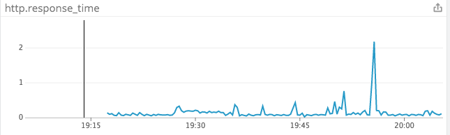

<!-- Intro to Lamp -->
<h1> Monitoring the LAMP stack with Datadog  </h1>

The LAMP stack is a set of open-source software used for creating websites and web applications. Lamp is named for its four original components: Linux, Apache, MySQL, and PHP. Though evolving to include alternatives like Python and Perl, it has retained its open-source nature. LAMP's cost-effective and flexible approach to web infrastructure makes it the most popular solution stack for hosting websites and web apps.

By providing real-time collection and vizualization of key metrics across each layer of the LAMP stack, Datadog offers a flexible and customizeable way to monitor your web app's performance and usage.

<figure>
    
    <figcaption>
  
  A custom dashboard created with Datadog for a sample LAMP stack
  
</figcaption>
</figure>

 

This post will walk you through the integration and configuration of each LAMP stack layer. You'll learn how to:

<ul>
  <li>Install the Datadog agent</li>
  <li>Integrate each layer of your LAMP stack with Datadog</li>
  <li>Configure Datadog to collect the desired metrics</li>
  <li>Customize, organize, and optimize your monitoring experience with custom metrics and custom dashboards</li>
</ul>

<!-- Datadog Installation -->
<h2>Installing the Datadog Agent</h2>

After you've created your
<a href="url">Datadog account</a>
(or signed up for a 14-day
<a href="https://www.datadoghq.com/">free trial</a>), you'll recieve an application key that you'll use to install the
<a href = "https://docs.datadoghq.com/agent/"> Datadog agent.</a> You can find the key in your <a href = "https://app.datadoghq.com/account/settings#api"> account </a>.

Run the following script to install the agent on your machine:

 
<code>
DD_API_KEY=<YOUR_API_KEY> bash -c "$(curl -L https://raw.githubusercontent.com/DataDog/datadog-agent/master/cmd/agent/install_script.sh)"
</code>

To check the success of the installation, run:

 
<code>
sudo datadog-agent status
</code>

If the installation was successful, you should see information about the running agent:
 
<code>
Getting the status from the agent. ============== Agent (v6.2.0) ============== Status date: 2018-05-16 19:45:31.773123 UTC Pid: 26471 Python Version: 2.7.12 Logs: Check Runners: 1 Log Level: info Paths ===== Config File: /etc/datadog-agent/datadog.yaml conf.d: /etc/datadog-agent/conf.d checks.d: /etc/datadog-agent/checks.d [...]
</code>

 

Now you're ready to view your host's metrics in real-time via the Datadog dashboard: go to Infrastructure, HostMap, and click on the system panel that appears after your host has been selected.

<figure>

<figcaption>

the host's system metrics:
 
Infrastructure->HostMap->your Host->System

</figcaption>
</figure>

 

After you've installed the Datadog Agent on your host, you can begin integrating the rest of your LAMP stack. Check out the
<a href = "https://docs.datadoghq.com/"> documentation
</a> to see a full list of <a href = "https://docs.datadoghq.com/agent/basic_agent_usage/amazonlinux/">commands </a> for the Datadog agent. The rest of this article will walk you through the steps necessary to monitor each software component in LAMP with Datadog.

<!-- Apache Integration, Configuration, and Monitoring -->
 
<h2>
Monitoring the Apache Web Server
</h2>

<h3>
Integration
</h3>

 Select the <a href = "https://app.datadoghq.com/account/settings#integrations/apache"> Apache tile </a> in the <a href = "https://app.datadoghq.com/account/settings#integrations/apache"> Integrations </a> section of the Datadog website. Following the directions in the tile, you may need to install
<a href = "http://httpd.apache.org/docs/current/mod/mod_status.html"> mod-status on your Apache server.
</a>

<h4>
Apache's status Module
</h4>

Your server's status page should be available at:

 
<code>
http://yourpage@example.com/server-status
</code>

 

If this link throws a forbidden access error, then you'll need to <a href = "https://www.datadoghq.com/blog/collect-apache-performance-metrics/#apache-s-status-module">
enable mod-status
</a> manually.

<h3>
Configuration
</h3>

To configure Apache to report metrics to the Datadog agent, navigate to your a 

<a href = "https://docs.datadoghq.com/agent/">
conf.d/apache.d/
</a> directory.

Create a conf.yaml file by copying the conf.yaml.example in the directory:
 
<code>
sudo cp conf.yaml.example conf.yaml
</code>

 

Edit the new conf.yaml file to match the following configuration, substituting in your password for the "pass" field:

 
When the agent runs, it will look for your conf.yaml file, and begin pulling metrics from Apache when it finds it.

To check that the agent is collecting data from Apache run the following two commands to:

 

restart the agent:

 
<code>
sudo service datadog-agent restart
</code>

 
 
check that Apache has been integrated successfully

 
<code>
sudo service datadog-agent restart
</code>

 
 
If Apache has been integrated succesfully, your output should contain a section like this:

 

 
<h3>
Monitoring
</h3>

Now that you have Apache integrated and configured, click "install" at the bottom of the tile, and visit your
<a href = "https://app.datadoghq.com/screen/integration/19/apache?page=0&is_auto=false&from_ts=1532285460000&to_ts=1532289060000&live=true"> Apache dashboard </a> to view your metrics. As illustrated in the example below, the collected data dynamically responds to server interaction in real-time.

<figure>

<figcaption>

The Apache Dashboard for a sample LAMP stack
 
Dashboards -> DasboardList -> Apache

</figcaption>
</figure>

 

<!-- MySQL Integration, Configuration, and Monitoring -->
 
<h2>
Monitoring the MySQL Database
</h2>

<h3>
Integration
</h3>

 Select the
 <a href = "https://app.datadoghq.com/account/settings#integrations/mysql"> MySQL tile
 </a> in the <a href = "https://app.datadoghq.com/account/settings#integrations/apache"> Integrations
 </a> section of the Datadog website.
Following the directions on the tile, use the following commands to:

create a Datadog user on your MySQL server:

 
<code>
sudo mysql -e "CREATE USER 'datadog'@'localhost' IDENTIFIED BY 'yourpassword';"
</code>

grant that user replication rights:

 
<code>
sudo mysql -e "GRANT REPLICATION CLIENT ON *.* TO 'datadog'@'localhost' WITH MAX_USER_CONNECTIONS 5;"
</code>

grant all additional permissions in order to obtain the full metrics catalog:

 
<code>
sudo mysql -e "GRANT PROCESS ON *.* TO 'datadog'@'localhost';"
</code>

 
<code>
sudo mysql -e "GRANT SELECT ON performance_schema.* TO 'datadog'@'localhost';"
</code>

Use the following commands to check if:

 
 
a Datadog user with replication rights has been created on the MySQL server:
 

<code>
mysql -u datadog --password='TFs1v1AEY9>kv84btq29n6Yy' -e "show status" | \
grep Uptime && echo -e "\033[0;32mMySQL user - OK\033[0m" || \
echo -e "\033[0;31mCannot connect to MySQL\033[0m"
mysql -u datadog --password='TFs1v1AEY9>kv84btq29n6Yy' -e "show slave status" && \
echo -e "\033[0;32mMySQL grant - OK\033[0m" || \
echo -e "\033[0;31mMissing REPLICATION CLIENT grant\033[0m"
</code>

 

Any additional priveleges have been granted:
 
<code>
mysql -u datadog --password='TFs1v1AEY9>kv84btq29n6Yy' -e "SELECT * FROM performance_schema.threads" && \
echo -e "\033[0;32mMySQL SELECT grant - OK\033[0m" || \
echo -e "\033[0;31mMissing SELECT grant\033[0m"
mysql -u datadog --password='TFs1v1AEY9>kv84btq29n6Yy' -e "SELECT * FROM INFORMATION_SCHEMA.PROCESSLIST" && \
echo -e "\033[0;32mMySQL PROCESS grant - OK\033[0m" || \
echo -e "\033[0;31mMissing PROCESS grant\033[0m"
</code>

 
<h3>
Configuration
</h3>

To configure MySQL to report metrics to the Datadog agent, navigate to your a 

<a href = "https://docs.datadoghq.com/agent/">
conf.d/mysql.d/
</a> directory.

Create a conf.yaml file by copying the conf.yaml.example in the directory:
 
<code>
sudo cp conf.yaml.example conf.yaml
</code>

Edit the conf.yaml file to match the following configuration:

 

When the agent runs, it will look for your conf.yaml file, and begin pulling metrics from MySQL. To check that the agent is collecting data from MySQL run the following two commands to:

 
 
restart the agent:

 
<code>
sudo service datadog-agent restart
</code>

 
 
check that mySQL has been integrated successfully
 
<code>
sudo service datadog-agent restart
</code>

 
If MySQL has been integrated succesfully, your output should contain a section like this:

 

<h3>
Monitoring
</h3>

Now that you have your MySQL server integrated and configured, click "install" at the bottom of the MySQL tile and visit your
<a href = "https://app.datadoghq.com/dash/integration/12/mysql---overview?live=true&page=0&is_auto=false&from_ts=1532285329014&to_ts=1532288929014&tile_size=m"> MySQL dashboard </a> to view your MySQL metrics in real-time.

<figure>

<figcaption>

The MySQL Dashboard for a sample LAMP stack
 
Dashboards -> DasboardList -> MySQL

</figcaption>
</figure>

 

<!-- Custom Dashboards -->

 
<h2> Custom Dashboards </h2>

Datadog dashboards allow you to gather customized vizualizations for any obtained metrics in one place. To create a custom dashboard, click on the "new dashboard" option in the Dashboards pane. Click on "add graphs" at the top of the page to drag and drop real-time vizualized metrics from all your integrations. For a full list of dashboard features, visit the
<a href = "https://www.datadoghq.com/dashboarding/">
Dashboarding page.
</a>

<figcaption>

A custom Dashboard for a sample LAMP stack
 
Dashboards -> New Dashboard

</figcaption>
</figure>

<!-- Custom Metrics -->

 
<h2> Custom Metrics </h2>

Custom metrics can be submitted to Datadog in a <a href = "https://docs.datadoghq.com/developers/metrics/#submitting-metrics"> number of ways </a>. The following method closely follows  the model of integration, configuration, and monitoring as described in the past two steps.

First, create a .yaml file inside your /etc/datadog-agent/conf.d directory using the following code:
 
<code>
sudo touch yourMetricName.yaml
</code>

 

Configure the <a href = "http://yaml.org/spec/1.2/spec.html" > Yaml file </a> using the following template:

<figcaption>

A yaml configuration template
 

</figcaption>
</figure>

 

Create a python file inside your /etc/datadog-agent/checks.d directory using the following code:
 
<code>
sudo touch yourMetricName.py
</code>

 

Make sure that both the .py and .yaml files have matching names. When your agent runs, it will look for your .yaml file and run the code inside your corresponding .py file, which can be configured to submit numerous metrics. Visit our Python <a href = "https://docs.datadoghq.com/api/?lang=python#overview"> documentation </a> for examples. With just a few lines of code, you'll be able to submit metrics like the following:

<figcaption>

http response time for a sample LAMP-based web app
 

</figcaption>
</figure>

<!-- Wrap up & Call to Action -->

 
<h2> Full LAMP Observability with Datadog </h2>

The LAMP solution stack is the most popular approach for hosting web apps and websites. We've shown you just a few ways to collect and visualize key metrics from each layer of your LAMP stack.

Datadog integrates with more than 250 other tools and services to provide a comprehensive, customizeable, and intuitive monitoring experience. Start monitoring your LAMP stack today with a
<a href = "https://www.datadoghq.com/">
free trial.
</a>

